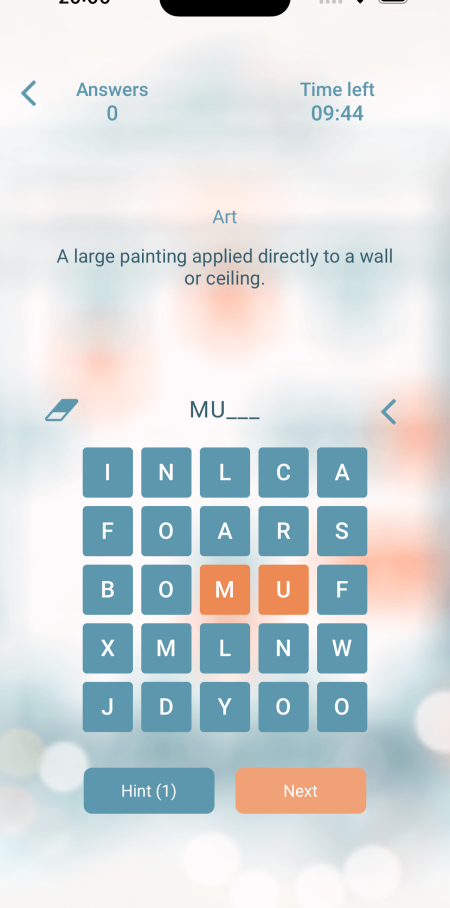

# WordFinder - Guess the Word

WordFinder is an engaging word puzzle game designed to challenge players' vocabulary and problem-solving skills.
It is built on .NET MAUI, ensuring a seamless gaming experience across various devices.

## Gameplay Overview

In this game, players are presented with a short word description and must decipher the hidden word from within a 5x5 character matrix. The word is cunningly concealed amidst other letters, adding an element of challenge to the gameplay.

### Features:

- **Hidden Word Matrix:** A 5x5 grid of characters hides the target word, shuffled with other letters to confound players.
- **Word Description:** Each word is accompanied by a brief description to provide context and aid players in their quest.
- **Random Letter Hints:** Players can opt to reveal random letters from the hidden word to assist in their guessing.
- **Word Categories:** (_planned_) Players can select from a variety of categories such as animals, cities, food, etc., or even input their own words. The complexity of the words varies based on the chosen category.
- **Time Challenge:** A global time counter adds an extra layer of challenge, encouraging players to solve each word within a specified time limit.

## Live

Download game from [AppStore](https://apps.apple.com/ua/app/word-finder-guess-the-word/id6502400462) &nbsp;&nbsp;&nbsp;&nbsp;&nbsp;&nbsp;&nbsp;&nbsp;&nbsp;&nbsp;&nbsp;&nbsp;&nbsp;&nbsp; &nbsp;&nbsp;&nbsp;&nbsp;&nbsp;&nbsp;&nbsp;&nbsp;&nbsp;&nbsp;&nbsp; [Goodle Play Market](https://play.google.com/store/apps/details?id=com.seniuk.wordfinder&pcampaignid=web_share)

 &nbsp;&nbsp;&nbsp;&nbsp;&nbsp;&nbsp;&nbsp;&nbsp; 

## Preview

